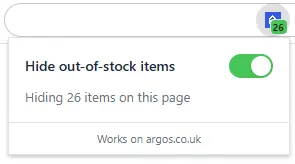
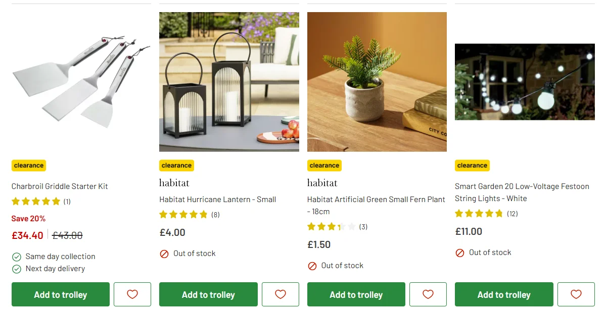
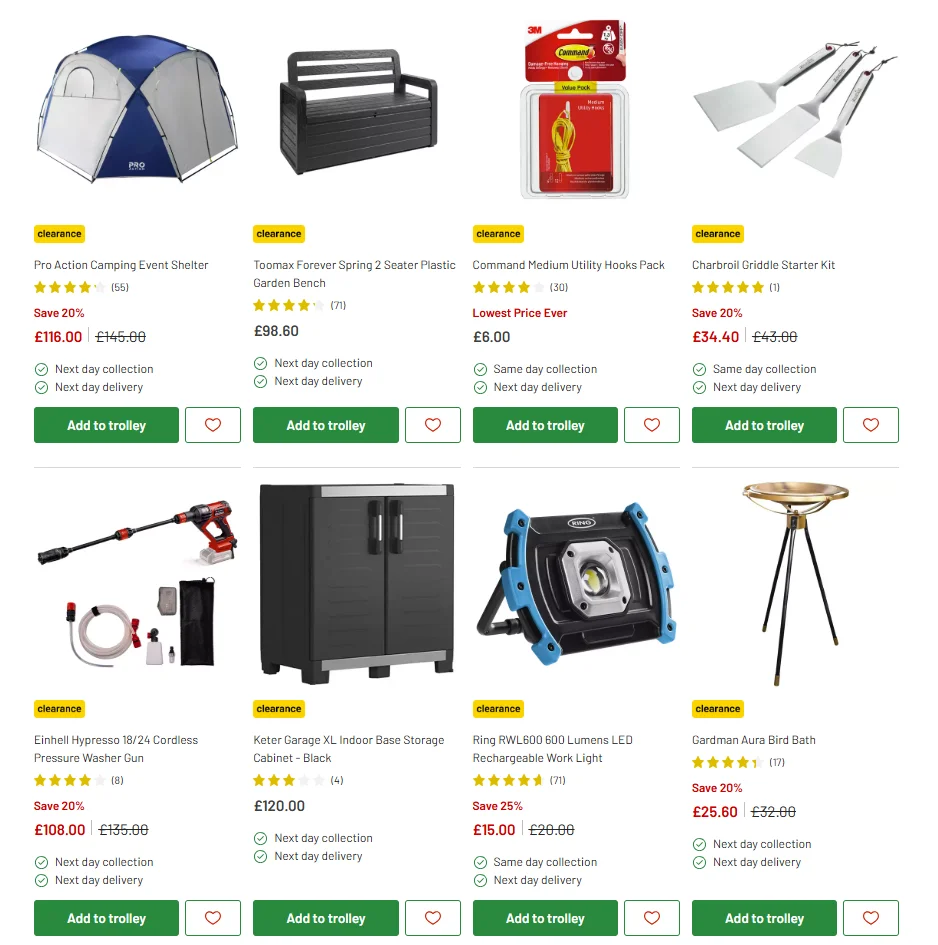

# Argos In-Stock Filter

Browsing [argos.co.uk](https://www.argos.co.uk/) clearance or sale pages means scrolling past a sea of "Out of stock" items that you can't actually buy. 

This extension removes them instantly — toggle it on and only purchasable products remain, making it far easier to spot genuine deals. Toggle it off at any time to restore the full listing.

## Features

- **One-click toggle** — click the toolbar icon to open the popup and flip the filter on or off.
- **Live badge** — the icon badge shows how many items are currently hidden on the active tab.
- **Dynamic icon** — coloured icon when the filter is ON, greyscale when OFF.
- **Infinite scroll / SPA aware** — a MutationObserver catches cards injected after initial load; history patching detects client-side navigation.
- **Zero reload required** — toggling takes effect instantly on all open Argos tabs.
- **No external dependencies** — plain vanilla JS, no build step.

## Screenshots

### Popup

### Before — out-of-stock items mixed in with available ones

### After — only in-stock items shown

## Installing the extension

Each [release](https://github.com/GarciaPL/argos-in-stock-filter/releases/latest) ships two ZIPs — one for Chromium-based browsers and one for Firefox:

| File | Browser |
|---|---|
| `argos-in-stock-filter-chrome.zip` | Chrome, Edge, Brave, and other Chromium browsers |
| `argos-in-stock-filter-firefox.zip` | Firefox |

---

### Chrome / Edge / Brave

#### Step 1: Download the files

Go to the [latest release](https://github.com/GarciaPL/argos-in-stock-filter/releases/latest) and download `argos-in-stock-filter-chrome.zip` from the "Assets" section.

#### Step 2: Extract to a permanent location

Unzip the file somewhere you won't accidentally delete it. A good choice is:
- **Windows:** `C:\Users\YourName\Documents\argos-filter\`
- **Mac:** `~/Documents/argos-filter/`

#### Step 3: Open the extensions page

Type `chrome://extensions` into the address bar and press Enter. (On Edge, use `edge://extensions`.)

#### Step 4: Enable Developer mode

Toggle **Developer mode** ON in the top-right corner. Three new buttons will appear.

#### Step 5: Load the extension

Click **Load unpacked**, then select the folder you extracted in Step 2 (the one containing `manifest.json`).

The extension appears in your extensions list and the icon appears in the toolbar. Done.

#### Step 6: Pin the icon (optional but recommended)

Click the puzzle-piece icon in the toolbar, find "Argos In-Stock Filter", and click the pin icon so it stays visible.

#### Updating to a new version

When a new release is published:
1. Download the new `argos-in-stock-filter-chrome.zip` from the [releases page](https://github.com/GarciaPL/argos-in-stock-filter/releases/latest)
2. Extract it, **replacing the old folder** (same location as before)
3. Go to `chrome://extensions` and click the refresh/reload icon on the Argos In-Stock Filter card

---

### Firefox

#### Step 1: Download the files

Go to the [latest release](https://github.com/GarciaPL/argos-in-stock-filter/releases/latest) and download `argos-in-stock-filter-firefox.zip` from the "Assets" section.

#### Step 2: Open Firefox Add-ons (temporary install)

Firefox does not allow loading unsigned extensions permanently outside of Developer Edition. To install temporarily:

1. Type `about:debugging` into the address bar and press Enter.
2. Click **This Firefox** in the left sidebar.
3. Click **Load Temporary Add-on...**.
4. Extract the ZIP, then navigate to the extracted folder and select `manifest.json`.

The extension loads immediately. Note: temporary installs are removed when Firefox restarts.

#### Updating to a new version

Download the new `argos-in-stock-filter-firefox.zip` from the [releases page](https://github.com/GarciaPL/argos-in-stock-filter/releases/latest) and repeat the install steps above.

## How it works

### Content script (`content.js`)

Runs on every `https://www.argos.co.uk/*` page.

1. Queries for elements matching `[data-test="component-product-card-availabilityIcon-oos"]` (Argos's OOS indicator).
2. For each match, walks up the DOM to the nearest product card using `el.closest('[class*="ds-c-product-card"], li, article')`.
3. Applies the CSS class `.argos-filter-hidden { display: none !important; }` to hide the card.
4. A `MutationObserver` (debounced via `CONFIG.debounceMs`) re-runs the filter when new cards are injected.
5. `history.pushState` / `history.replaceState` and `popstate` are patched to handle SPA navigation.
6. Sends the current hidden count to the background worker after every pass.

### Background service worker (`background.js`)

- Initialises `chrome.storage.sync` with `{ enabled: true }` on first install.
- Listens for storage changes and updates the toolbar icon and badge colour across all tabs.
- Maintains a per-tab count map and refreshes the badge when tabs are activated or navigated.

### Popup (`popup.html` / `popup.js` / `popup.css`)

- Large toggle switch bound to `chrome.storage.sync.enabled`.
- Status line showing how many items are hidden on the current page (refreshed every second).
- Respects `prefers-color-scheme` for light/dark mode.

## Files

| File | Purpose |
|---|---|
| `manifest.chrome.json` | Extension manifest for Chrome/Chromium (MV3) |
| `manifest.firefox.json` | Extension manifest for Firefox (MV3 + gecko id) |
| `content.js` | DOM filtering logic |
| `background.js` | Service worker — icon, badge, storage |
| `popup.html/js/css` | Toolbar popup UI |
| `icons/` | Extension icons |
